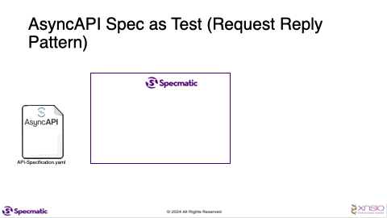

# Specmatic Kafka Sample

* [Specmatic Website](https://specmatic.io)
* [Specmatic Documenation](https://docs.specmatic.io)

This sample project demonstrates how we can run contract tests against a service which interacts with a kafka broker.

## Background
This project includes a consumer that listens to messages on a specific topic.
Upon receiving a message, the consumer processes it and publishes a new message to two other designated topics.




## Pre-requisites
* Gradle
* JDK 17+
* Docker

## Run the tests
```shell
./gradlew clean test
```

## Run the contract tests using specmatic-kafka docker image

1. Start the kafka broker using below command.
   ```shell
   docker compose up
   ```
2. Create the required topics in the running Kafka broker.
   ```shell
   docker exec kafka /opt/kafka/bin/kafka-topics.sh --create --topic place-order --partitions 3 --replication-factor 1 --bootstrap-server localhost:9092
   docker exec kafka /opt/kafka/bin/kafka-topics.sh --create --topic process-order --partitions 3 --replication-factor 1 --bootstrap-server localhost:9092
   docker exec kafka /opt/kafka/bin/kafka-topics.sh --create --topic notification --partitions 3 --replication-factor 1 --bootstrap-server localhost:9092
   ```
3. Run the application.
   ```shell
   ./gradlew bootRun
   ```
4. Run the contract tests.
   ```shell
   docker run --network host -v "$PWD/specmatic.yaml:/usr/src/app/specmatic.yaml" -v "$PWD/src/test/resources:/usr/src/app/examples" -v "$PWD/build/reports:/usr/src/app/build/reports" specmatic/specmatic-kafka test --broker localhost:9092 --examples=examples
   ```

## Get information around other CLI args exposed by specmatic-kafka docker image

1. To get information around all the CLI args of the `mock` command, run the following.
   ```shell
    docker run specmatic/specmatic-kafka mock --help
   ```
2. To get information around all the CLI args of the `test` command, run the following.
   ```shell
    docker run specmatic/specmatic-kafka test --help
   ```
